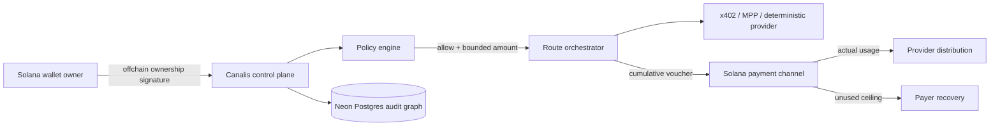

# Crypto World's Fair submission package

## Form copy

**Product:** Canalis

**Track:** Solana Ecosystem

**One-line pitch:** Canalis gives autonomous agents a user-approved budget, then enforces where every dollar can go, proves what was purchased, settles actual usage on Solana, and recovers the rest.

**Problem:** Agents can call paid APIs faster than a person can supervise them, but a wallet approval or API key alone does not express a bounded mandate. Teams need payment controls, evidence, and recovery—not an unlimited hot wallet.

**Wedge:** Solana agent builders orchestrating several x402, MPP, or channel-backed machine services from one task budget.

**User:** Developers and operators deploying autonomous agents that buy search, data, inference, or other metered services.

**Business model:** A team subscription for the policy/audit control plane plus a small fee on successfully orchestrated paid volume. Enterprise plans add compliance export, approval workflows, and managed recovery.

**Public product:** <https://canalis-sigma.vercel.app>

**Source:** <https://github.com/EcstaceeLOR/Canalis>

**Team:** DemolaCodes / [EcstaceeLOR](https://github.com/EcstaceeLOR)

**Contact:** `abdulmuizademola9@gmail.com`

## Why Solana

Canalis uses Solana for the settlement boundary where low-cost, fast finality makes small machine-to-machine payments practical. The application keeps high-frequency cumulative authorization offchain, while the canonical payment-channel lifecycle escrows a ceiling, settles only actual authorized usage, distributes provider funds, and returns the remainder to the payer. Canalis does not deploy a look-alike channel contract or fabricate transaction evidence.

Current public devnet evidence:

- [Channel account](https://explorer.solana.com/address/2geWGYUCktR6qg4EcN4Qki7bAEUcQHFZbBxuvs1AEsHk?cluster=devnet)
- [Open transaction](https://explorer.solana.com/tx/3BjuK14J5rh81H8YtWjY6zA7nYmSsg9PfZF34m53Y99EWtyPQTKPS9xivZ9MsAKEoWcwCnxoBnTL3h47BywRd2v1?cluster=devnet)
- [Finalization transaction](https://explorer.solana.com/tx/Mp82KwadrqJkoohK9TmPijmeE9QMv8FNwA25FR2Nb1oi7gq8ecB9F44rgE2HZstqo7Kqci1URPAdmdAHGLjdubg?cluster=devnet)

## Architecture and payment flow

## Two-minute pitch script

**0:00–0:20 — Problem.** Autonomous agents are becoming economic actors, but today we mostly hand them a wallet or API key and hope prompt instructions hold. That is not a spending mandate.

**0:20–0:45 — Product.** Canalis lets a user approve one bounded task budget. Every paid call must pass total-budget, per-call, provider, asset, network, and expiry policy. Each decision becomes an attributable receipt.

**0:45–1:15 — Demo.** Connect a Solana wallet. Run the one-dollar reference task. Watch Search, Data, and Inference consume five, three, and twelve cents. Inspect why each payment was allowed, then lower the per-call cap and watch the policy reject the expensive step before authorization.

**1:15–1:40 — Solana.** Canalis maps a logical task to provider-scoped Solana payment channels. Cumulative vouchers avoid an onchain transaction for every micro-call; finalization distributes actual usage and returns unused escrow. The linked devnet open and finalization transactions are real and finalized.

**1:40–2:00 — Business.** We start with agent developers buying metered services and expand into the policy and audit layer for machine commerce: subscription software plus a fee on successful routed volume.

## Three-minute technical demo runbook

1. Open the public product and state the one-line pitch (15 seconds).
2. Connect MetaMask or another Solana Wallet Standard wallet and approve only the ownership message (20 seconds).
3. Open the Reference Task with a `$1.00` budget and `$0.25` per-call cap (20 seconds).
4. Run it; show three paid provider steps, `$0.20` spent, and `$0.80` remaining (35 seconds).
5. Inspect Search payment evidence: policy decision, cumulative authorization, and response hash (25 seconds).
6. Set the cap to `$0.04`; rerun and show `PER_CALL_CAP_EXCEEDED` before the five-cent call can be authorized (25 seconds).
7. Open the devnet Explorer links and explain channel open → cumulative settlement → distribution/recovery (25 seconds).
8. Close on the user, wedge, and business model (15 seconds).

## Submission-day checklist

- [ ] Record and upload the two-minute pitch using the exact script above.
- [ ] Record and upload the technical demo at three minutes or less.
- [ ] Add both public, no-login video URLs to this document and the Colosseum form.
- [ ] Confirm the team leader and every team member are registered on Colosseum.
- [ ] Confirm the product URL, repository, and Explorer links open in a private browser.
- [ ] Confirm `verify`, `judge-path`, and `preview-judge-path` are green on the tagged commit.
- [ ] Capture fresh 1440px screenshots after the production tag and place them in `docs/assets/`.
- [ ] Submit before **11:59 PM Pacific on October 12, 2026**; do not treat a Git tag as a Colosseum submission.

The official judging criteria are functionality/code quality, potential impact, novelty, UX, open-source composability, and business plan. The product and videos should make each criterion observable rather than merely claim it.
